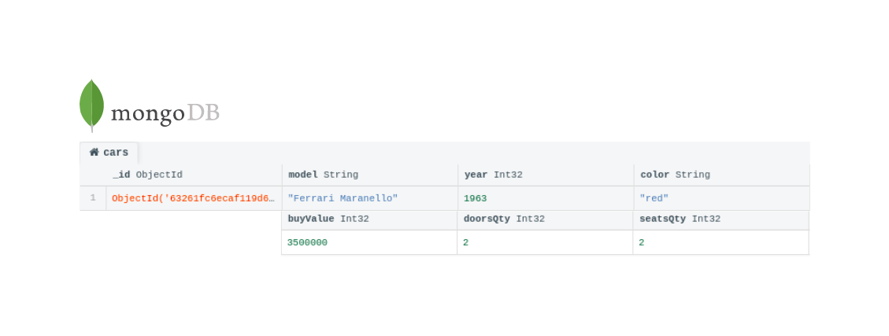
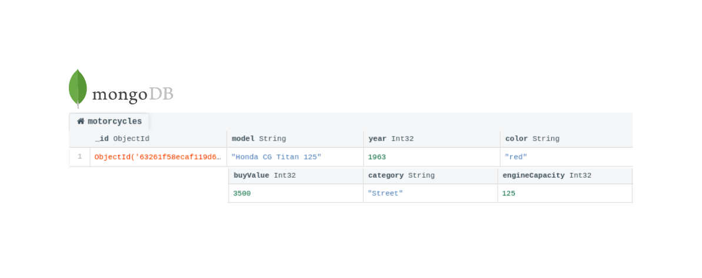

Este projeto contém os requisitos realizados por _[Anna Beatriz Garcia Trajano de Sá](www.linkedin.com/in/anna-beatriz-trajano-de-sá)_ enquanto estudava na [Trybe](https://www.betrybe.com/) :rocket:

# Project Car Shop - Mongoose e arquitetura MSC

Nesse projeto, apliquei os princípios de POO para a construção de uma API com CRUD para 
gerenciar uma concessionária utilizando como banco de dados o MongoDB.

## Banco de Dados - Car Shop

Vehicle
:-------------------------:|
  |

---

Motorcycle
:-------------------------:|
  |

---

## Instalação do projeto localmente:
 
Após cada um dos passos, haverá um exemplo do comando a ser digitado para fazer o que está sendo pedido, caso tenha dificuldades e o exemplo não seja suficiente, não hesite em me contatar em _annagarcia@id.uff.br_ 

1. Abra o terminal e crie um diretório no local de sua preferência com o comando **mkdir**:
```javascript
  mkdir projetos
```

2. Entre no diretório que acabou de criar e depois clone o projeto:
```javascript
  cd projetos
  git clone git@github.com:annatrajano/project-car-shop.git
```

3. Acesse o diretório do projeto e depois utilize o comando **npm i** para instalar todas as dependências necessárias:
```javascript
  cd project-car-shop
  npm i
```
<details>
  <summary>
    <strong>🐳 Rodando no Docker vs Localmente</strong>
  </summary><br>

  ## Docker

  > Rode os serviços `node` e `mongodb` com o comando `docker-compose up -d`.
  - Lembre-se de parar o `mongo` se estiver usando localmente na porta padrão (`27017`), ou adapte, caso queria fazer uso da aplicação em containers
  - Esses serviços irão inicializar um container chamado `car_shop` e outro chamado `car_shop_db`.
  - A partir daqui você pode rodar o container `car_shop` via CLI ou abri-lo no VS Code.

  > Use o comando `docker exec -it car_shop bash`.
  - Ele te dará acesso ao terminal interativo do container criado pelo compose, que está rodando em segundo plano.

  > Instale as dependências [**Caso existam**] com `npm install`
  
  ⚠ Atenção ⚠ Caso opte por utilizar o Docker, **TODOS** os comandos disponíveis no `package.json` (npm start, npm test, npm run dev, ...) devem ser executados **DENTRO** do container, ou seja, no terminal que aparece após a execução do comando `docker exec` citado acima. 

  ⚠ Atenção ⚠ O **git** dentro do container não vem configurado com suas credenciais. Ou faça os commits fora do container, ou configure as suas credenciais do git dentro do container.

  ⚠ Atenção ⚠ Não rode o comando npm audit fix! Ele atualiza várias dependências do projeto, e essa atualização gera conflitos com o avaliador.


  ✨ **Dica:** A extensão `Remote - Containers` (que estará na seção de extensões recomendadas do VS Code) é indicada para que você possa desenvolver sua aplicação no container Docker direto no VS Code, como você faz com seus arquivos locais.

  

  ## Localmente

  > Instale as dependências [**Caso existam**] com `npm install`
  
  ⚠ Atenção ⚠ Não rode o comando npm audit fix! Ele atualiza várias dependências do projeto, e essa atualização gera conflitos com o avaliador.

  ✨ **Dica:** Para rodar o projeto desta forma, obrigatoriamente você deve ter o `node` instalado em seu computador.
  ✨ **Dica:** O avaliador espera que a versão do `node` utilizada seja a 16.

</details>

<details>
  <summary>
    <strong>🛠 Testes</strong>
  </summary><br>

  Para executar os testes localmente, digite no terminal o comando `npm test`.

  👀**De olho na dica**: especialmente no início, quando a maioria dos testes está falhando, a saída após executar os testes é bastante poluída. Você pode desabilitar temporariamente um teste utilizando a função `skip` junto à função `describe`. Como o nome indica, a função a seguir "pula" um teste:

  ```typescript
  describe.skip('...', () => {})

  ```
</details>

## Habilidades Desenvolvidas

Neste projeto, desenvolvi as seguintes habilidades:

 - Exercitar o conhecimento dos pilares da Programação Orientada a Objetos: Herança, Abstração, Encapsulamento e Polimorfismo;
 - Exercitar a utilização de Composição;
 - Exercitar a criação e utilização de Interfaces;
 - Implementar, em TypeScript: Classes, Instâncias, Atributos, Métodos e Objetos;
 - Aplicar os conhecimentos de MongoDB, Typescript e POO para criar uma API com CRUD.


 
 ## Referências
 
 [Documentação Oficial - MongoDB](https://www.mongodb.com/docs/)<br>
 [Connections com Mongoose](https://mongoosejs.com/docs/connections.html)<br>
 [TypeScript + Mongoose - Schemas](https://mongoosejs.com/docs/typescript/schemas.html#schema-vs-interface-fields)<br>
 [Conventional Commits](https://gist.github.com/qoomon/5dfcdf8eec66a051ecd85625518cfd13)<br>

 
 ## Escopo do Projeto
 
 ### 01 - Crie a interface `IModel` genérica

Crie a interface `IModel`, que será usada para a conexão com o banco de dados. Ela deverá ter, pelo menos, as funções `create()`, `read()`, `readOne()`, `update()` e `delete()`.

### 02 - Crie a interface `IVehicle` genérica

Crie a interface `IVehicle`, que será usada para criarmos nossos tipos de carro, moto e caminhão.

### 03 - Crie a interface `ICar` a partir da interface `IVehicle`

Crie a interface `ICar`, de modo que ela possua todos os atributos da interface `IVehicle` e, também, os atributos:

### 04 - Crie uma rota para o endpoint `/cars` onde seja possível cadastrar um novo carro

Crie uma rota que receba uma requisição `POST` para cadastrar um veículo do tipo carro.

### 05 - Escreva testes para cobrir 15% da camada de Model

Escreva testes que cubram, pelo menos, 15% da camada Model. Seus arquivos de teste deverão estar na pasta `src/tests/unit/model`.

### 06 - Escreva testes para cobrir 15% da camada de Service

Escreva testes que cubram, pelo menos, 15% da camada Service. Seus arquivos de teste deverão estar na pasta `src/tests/unit/services`.

### 07 - Escreva testes para cobrir 15% da camada de Controller

Escreva testes que cubram, pelo menos, 15% da camada Controller. Seus arquivos de teste deverão estar na pasta `src/tests/unit/controllers`.

### 08 - Crie uma rota para o endpoint `/cars` onde seja possível listar todos os carros registrados

Crie uma rota que receba uma requisição `GET` para receber todos os veículos do tipo carro registrados no banco de dados.

### 09 - Crie uma rota para o endpoint `/cars/id` onde seja possível listar um único carro através do seu id

Crie uma rota que receba uma requisição `GET` para receber determinado veículo do tipo carro que possua o `id` passado como parâmetro na rota.

### 11 - Escreva testes para cobrir 30% da camada de Service

Escreva testes que cubram, pelo menos, 30% da camada Service. Seus arquivos de teste deverão estar na pasta `src/tests/unit/services`.

### 13 - Crie uma rota para o endpoint `/cars/id`, onde é possível atualizar o registro de um carro através do seu id

Crie uma rota que receba uma requisição `PUT` para atualizar determinado veículo do tipo carro que possua o `id` passado como parâmetro na rota.

### 14 - Escreva testes para cobrir 60% da camada de Model

Escreva testes que cubram, pelo menos, 60% da camada Model. Seus arquivos de teste deverão estar na pasta `src/tests/unit/model`.

### 15 - Escreva testes para cobrir 60% da camada de Service

Escreva testes que cubram, pelo menos, 60% da camada Service. Seus arquivos de teste deverão estar na pasta `src/tests/unit/services`.

### 16 - Escreva testes para cobrir 60% da camada de Controller

Escreva testes que cubram, pelo menos, 60% da camada Controller. Seus arquivos de teste deverão estar na pasta `src/tests/unit/controllers`.

### 17 - Crie uma rota para o endpoint `/cars/id` para excluir os registros de um carro

Crie uma rota que receba uma requisição `DELETE` para excluir determinado veículo do tipo carro que possua o `id` passado como parâmetro na rota. 

## Requisitos Bônus

### 18 - Crie a interface `IMotorcycle` a partir da Interface `IVehicle`

Crie a interface `IMotorcycle`, de modo que ela possua todos os atributos da interface `IVehicle` e, também, os atributos:

### 19 - Crie uma rota para o endpoint `/motorcycles` onde seja possível cadastrar uma nova moto

Crie uma rota que receba uma requisição `POST` para cadastrar um veículo do tipo moto.

### 20 - Crie uma rota para o endpoint `/motorcycles` onde seja possível listar todas as motos registradas

Crie uma rota que receba uma requisição `GET` para receber todos os veículos do tipo moto registrados no banco de dados.

### 21 - Crie uma rota para o endpoint `/motorcycles/id` onde seja possível listar uma única moto através do seu id

Crie uma rota que receba uma requisição `GET` para receber determinado veículo do tipo moto que possua o `id` passado como parâmetro na rota.

### 22 - Crie uma rota para o endpoint `/motorcycles/id` onde é possível atualizar o registro de uma moto através do seu id

Crie uma rota que receba uma requisição `PUT` para atualizar determinado veículo do tipo moto que possua o `id` passado como parâmetro na rota.


### 23 - Crie uma rota para o endpoint `/motorcycles/id` para excluir os registros de uma moto

Crie uma rota que receba uma requisição `DELETE` para excluir determinado veículo do tipo moto que possua o `id` passado como parâmetro na rota.
